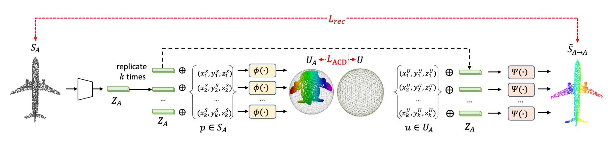
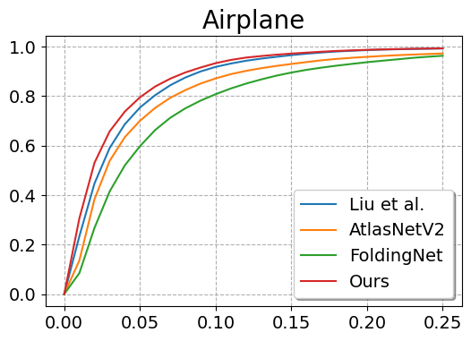

# CanonicalPAE
### [project page](https://anjiecheng.github.io/cpae/) |   [paper](https://proceedings.neurips.cc/paper/2021/file/3413ce14d52b87557e87e2c1518c2cbe-Paper.pdf)

This repository is the implementation of Learning 3D Dense Correspondence via Canonical Point Autoencoder. 



## Requirements
```bash
conda create -n CPAE python=3.6
conda activate CPAE
pip install -r requirements.txt
```
To install PyMesh
```setup
https://pymesh.readthedocs.io/en/latest/installation.html#building-pymesh
```

To install Chamfer Loss 
```setup
cd correspondence/auxiliary
git clone https://github.com/ThibaultGROUEIX/ChamferDistancePytorch
```

To install EMD Loss, please follow the instruction in [
MSN-Point-Cloud-Completion](https://github.com/Colin97/MSN-Point-Cloud-Completion). The installed `emd` folder should be under `correspondence/auxiliary`.


### Dataset
Please download the KeypointNet dataset from [here](https://github.com/qq456cvb/KeypointNet), and modify the path in the config file.


## Usage
### Train
```bash
python train.py configs/keypoint/default.yaml -c airplane
```

You may specify the category using the `--categories` argument. 

### Test
```bash
python eval.py configs/keypoint/default.yaml -c airplane --load PATH_TO_WEIGHT
```
The result file which contains error distance between keypoints will be saved in your `['training']['out_dir']` directory. You can specify the folder using the `--tag` argument.

### Pretrain
Pretrained models together with the baselines' result files can be downloaded [here](https://drive.google.com/file/d/1m1NOxIzHA89lflA6d8CWzN8DlnRV_xVP/view?usp=sharing).

### Evaluation
To plot the curve as below, please see the notebook file in `out/plot_curve.ipynb`.



